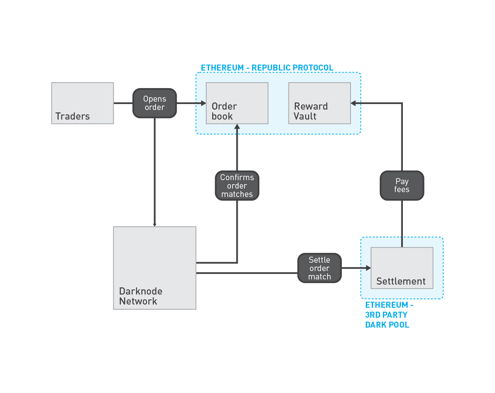

# Republic Protocol

* [Darknodes](./pages/01-darknodes.md)
* [Dark pools](./pages/02-third-party-dark-pools.md)

Republic Protocol is an open-source protocol powering decentralised dark pools. It is run by a decentralised network of Darknodes that using [secure multi-party computation](https://en.wikipedia.org/wiki/Secure_multi-party_computation) to match orders without exposing the price, or volume, of the orders. Dark pools powered by Republic Protocol can support large volume trades, with minimal price slippage and market impact, whilst guaranteeing that the rules of the dark pool cannot be broken.

## How it works

