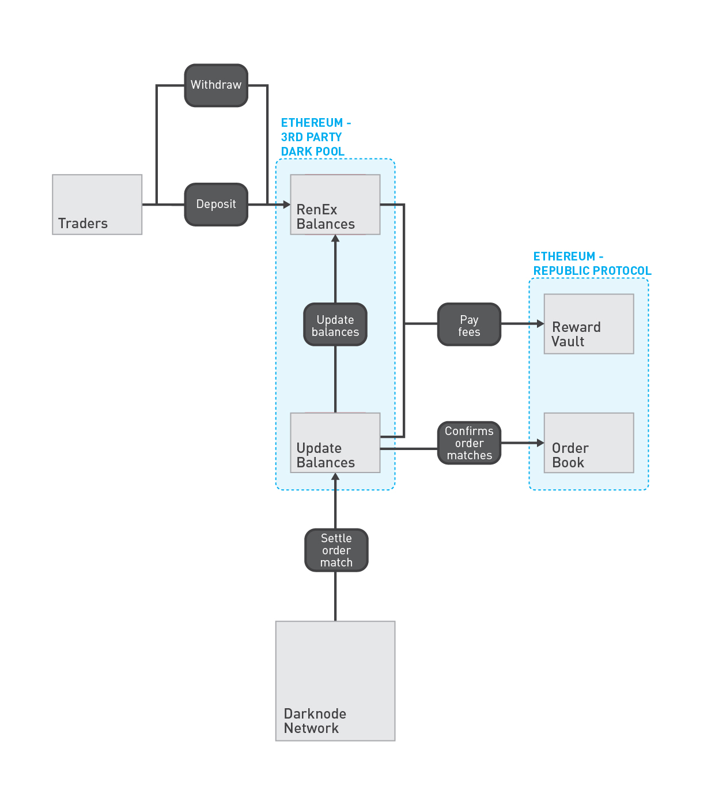

# Third-Party Dark Pools

Dark pools are third-party exchanges, built on top of Republic Protocol, that use the Secure Order Matcher to implement a decentralised order matcher that does not expose the price or volume of orders. Dark pools are responsible for implementing settlement and brokerage. Dark pools can be centralised or decentralised, as long as the interface required by Republic Protocol is exposed.

## Settlement

Dark pools must define a settlment contract with an ABI for preparing orders for settlement, and for executing the settlement.

### Preparing orders for settlement

```sol
function submitOrder(bytes _order, uint8 _settlement, uint64 _tokens, uint256 _price, uint256 _volume, uint256 _minVolume) returns (bool) { /* ... */ }
```

### Executing the settlement

```sol
function settle(bytes32 _buy, bytes32 _sell) returns (bool) { /* ... */ }
```

### Example

RenEx supports the settlement of Ethereum tokens using a set of Ethereum smart contracts.




### Paying Fees

At the moment of settlement, the dark pool is required to pay a fee to the Darknode that initiated the settlement.

## Brokerage

Dark pools may optionally require that an approved broker signs an order before the order can be opened on the dark pool. Dark pools must implement an Ethereum smart contract that expose a function

```sol
function verifyOrderSignature(bytes32 _order, bytes _signature) returns (bool) { /* ... */ }
```

that accepts the Keccak256 hash of an order and the broker signature that was provided when the order was opened. This gives the dark pool control over whether or not to approve an order that a trader is trying to open.

